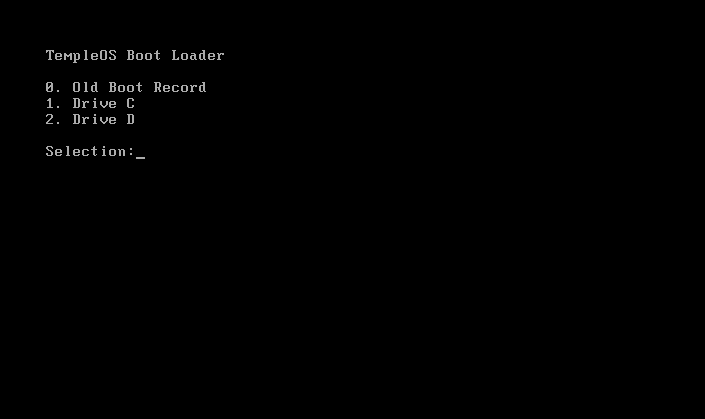

After installing, and booting into TempleOS you'll be greeted with TempleOS's holiest and simplistic bootloader, from here just enter `1` to boot into the C drive.

    
<b>Bootloader</b>

      
        

# The OS
Once fully inside, you'll be asked if you'd like to take the tour; thankfully Terry Davis was kind enough to teach people how to use his system. For the purpose of this guide, I'll be ignoring the guide and exploring things my own way - although, don't take that as an excuse to not explore the vastness of the tour, going so much as guiding you through everything, how kind of you Terry. Floating over on the right of your screen is a super helpful tool called "AutoComplete"; which - you guessed it - is a program that autocompletes what you're typing system-wide. Autocomplete can be enabled with <kbd>Alt+A</kbd> and disabled with <kbd>Shift+Alt+A</kbd>. From the start, we'll be greeted with two command windows or "terminals".

The entirety of TempleOS - disregarding a portion of assembly code - is written in a C variant created by Terry A. Davis titled "HolyC" with its own appropriately named "HolyC" compiler. What might be surprising about TempleOS is that the "SHELL" environment goes directly to the compiler, thus being completely different from something like Linux using BASH which is a standalone program used for executing programs, instead TempleOS resembles something like how the Python Interpreter has its own Read-eval-print loop which feeds directly to the interpreter (although with HolyC it is way faster). Pairing one of the powerful languages with a direct user input might seem crazy, but it's ridiculously overpowered! <i>We will be diving deeper into commands and the inner workings in the next chapter.</i>

    
<b>The Terminal</b>

      
        

# The UI
At the top of the screen, a lot of system information is display; accurate date and time, FPS, Memory and CPU, and farthest to the right we have text displaying our last key press. Below this initial region we have a second bar of information for the current program; a link to the Personal Menu, task name, process ID, and our close button (depicted as `[X]`).